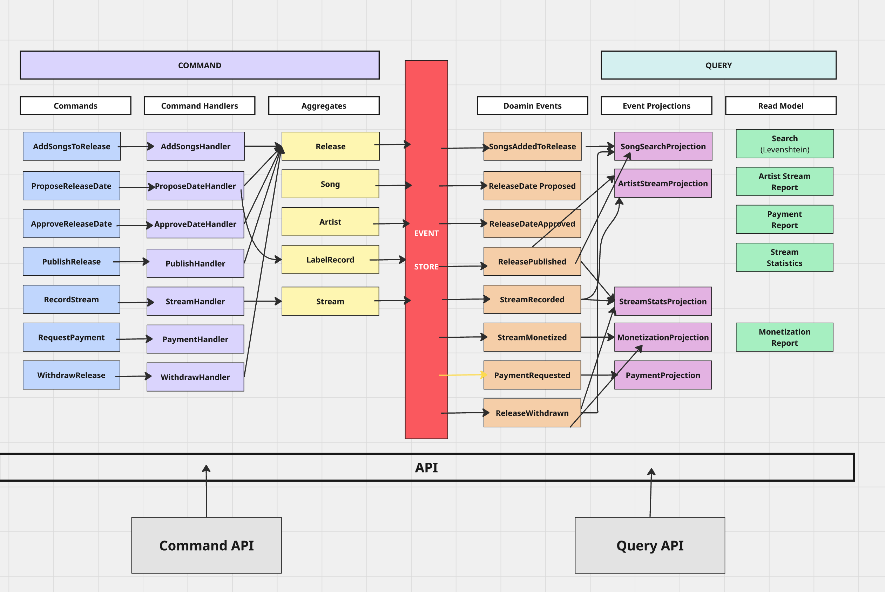
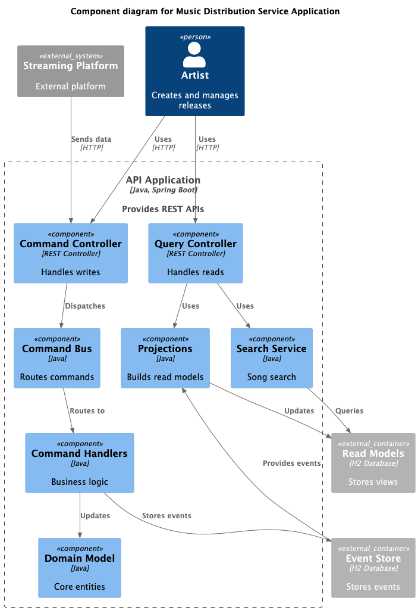
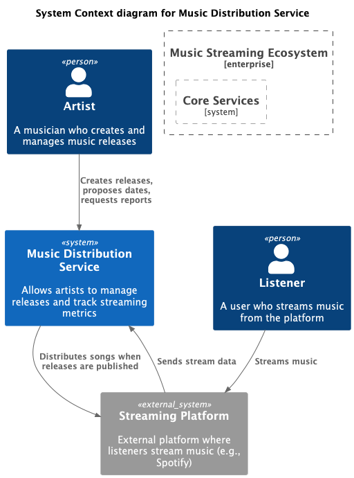
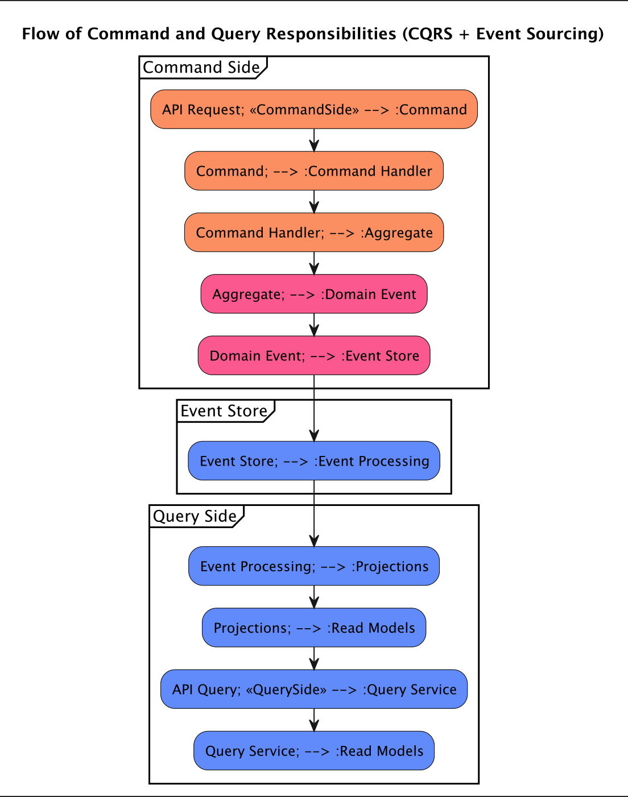
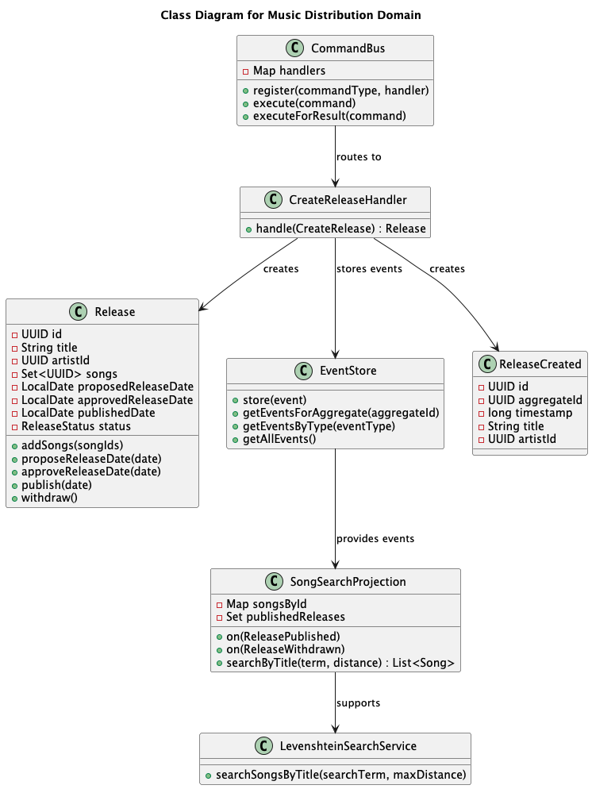

# Music Distribution Service (CQRS/Event-Driven Example)

This project demonstrates a Music Distribution backend service built using Spring Boot, applying Command Query Responsibility Segregation (CQRS) and event-driven principles potentially derived from Event Storming. It manages entities like Labels, Artists, Songs, Releases, and Streams, focusing primarily on the release lifecycle and stream reporting.

## Architecture Overview

The application's design is heavily influenced by CQRS and event-driven patterns.

### CQRS (Command Query Responsibility Segregation)

The core idea is to separate operations that change state (Commands) from operations that read state (Queries).

*   **Commands:** Represent an intent to change the system's state (e.g., `CreateRelease`, `AddSongsToRelease`, `ApproveReleaseDate`, `PublishRelease`). They are dispatched via a `CommandBus` (though some handlers might be invoked directly in this implementation) and handled by dedicated `CommandHandlers`.
*   **Command Handlers:** Contain the logic to process a specific command. They typically load an **Aggregate Root** (like `Release`), execute business logic on it, and persist the changes (often by saving the aggregate and/or publishing events).
*   **Aggregates:** Encapsulate state and business rules (e.g., `Release`, `Song`, `Artist`). They validate commands and generate **Domain Events** upon successful state changes.
*   **Domain Events:** Represent significant occurrences in the past (e.g., `ReleaseCreated`, `SongsAddedToRelease`, `ReleaseDateApproved`, `ReleasePublished`, `StreamRecorded`). They are the primary output of the command side after state changes.
*   **Event Store/Bus:** Events generated by aggregates are persisted (using `EventStore` in this example) and/or published for projections to consume.
*   **Projections:** Listen to domain events (using Spring's `@EventListener` or similar) and build/update specialized **Read Models** optimized for specific query needs (e.g., `ArtistStreamProjection`, `SongSearchProjection`). They are decoupled from the command side.
*   **Read Models:** Denormalized data structures tailored for efficient querying (e.g., `ArtistStreamReport`, `SongReadModel`).
*   **Queries:** Represent requests for data. They directly query the Read Models via `QueryControllers` or the Projections themselves, bypassing the command side and aggregates.

This separation allows for:
*   Independent scaling of command and query workloads.
*   Optimized data models for both writing and reading.
*   Increased flexibility and resilience.

### Event Storming & Event-Driven Approach

The design likely originated from identifying key domain events through techniques like Event Storming. The application follows an event-driven approach where:

1.  Commands are processed by Aggregates via Handlers.
2.  Aggregates produce Domain Events upon state change.
3.  These Events are published/stored via the `EventStore`.
4.  Projections subscribe to these Events and update their respective Read Models.
5.  Queries read directly from these eventually consistent Read Models.

This makes the system reactive and facilitates decoupling between different parts of the application.

## System Diagrams

**Overall CQRS Flow**

**Component Diagram**

**Context Diagram**

**Flow Diagram**

**Simplified Calss Diagram**

## Scope and Setup
**Note:** To keep the project focused on the CQRS/ Event-Driven aspects of the release lifecycle and reporting, **standard CRUD (Create, Read, Update, Delete) functionality for managing Labels, Artists, and Songs via API endpoints has been intentionally omitted**.

## Prerequisites

*   **Java:** JDK 21 or later (as per `build.gradle`)
*   **Build Tool:** Gradle (Version 8.7)
*   **Database:** The application uses H2 for testing by default (see `application-test.yml`).
F
## Running the Application
Run the application using Gradle:

` ./gradlew bootRun
`

Running Tests:

` ./gradlew test
`

## Demonstration Test (`MusicDistributionDemoTest`)
1. The test class `src/test/java/com/ice/musicdistribution/demo/MusicDistributionDemoTest.java` is included specifically and **_only for demonstrating_** the end-to-end flow of the CQRS architecture within this application.

*   **Purpose:** It simulates a sequence of commands (creating a release, adding songs, proposing/approving dates, publishing, recording streams) and subsequent queries (searching for songs, generating reports) using the pre-inserted base data.
*   **Not a Production Test:** This test includes extensive `System.out.println` statements to trace the flow of commands, events, and query results. It is **not** intended as a standard unit or integration test for production validation but serves as a learning and demonstration tool.
*   **Usage:** Run this test to observe how commands trigger events, how projections update read models (implicitly), and how queries reflect the state changes.

## API Documentation (Swagger UI)

Once the application is running, you can access the interactive API documentation provided by Swagger UI (using `springdoc-openapi-starter-webmvc-ui`).

Open your web browser and navigate to:

http://localhost:8080/api/swagger-ui/index.html

**Using Swagger with Pre-inserted Data:**

Since there are no API endpoints to create labels, artists, or songs, you **must first run the SQL script** provided in the "Database Setup" section before using Swagger to test commands that rely on this data. After inserting this data:

1.  You can use Swagger UI to test endpoints such as:
    *   Creating a new release (you'll need the `artistId` from the script: `b2c3d4e5-f6a7-8901-2345-67890abcdef0`).
    *   Adding songs to a release (you'll need the `songId`s from the script: `c3d4e5f6-a7b8-9012-3456-7890abcdef01`, `d4e5f6a7-b8c9-0123-4567-890abcdef012`).
    *   Approving a release (you'll need the `labelId` from the script: `a1b2c3d4-e5f6-7890-1234-567890abcdef`).
    *   Searching for songs (e.g., search for "Bad Habits" or "Galway Girl").
    *   Generating reports for the artist.
2.  Keep the UUIDs from the SQL script handy, as you will need to provide them as parameters in the relevant API requests via Swagger UI.

**Database Setup:**

Once the application is running, open your web browser and navigate to:
http://localhost:8080/api/h2-console/

*   **JDBC URDriver Class:** `org.h2.Driver`
*   **JDBC URL:** `jdbc:h2:mem:musicdb`
*   **User Name:** `sa`
*   **Password:** `password`

**`INSERT INTO labels (id, name) VALUES ('a1b2c3d4-e5f6-7890-1234-567890abcdef', 'XYZ Records'); `**

**`INSERT INTO artists (id, name, label_id) VALUES ('b2c3d4e5-f6a7-8901-2345-67890abcdef0', 'Ed Sheeran', 'a1b2c3d4-e5f6-7890-1234-567890abcdef');  `**

**`INSERT INTO songs (id, title, artist_id, duration_seconds) VALUES ('c3d4e5f6-a7b8-9012-3456-7890abcdef01', 'Bad Habits', 'b2c3d4e5-f6a7-8901-2345-67890abcdef0', 240); `**

**`INSERT INTO songs (id, title, artist_id, duration_seconds) VALUES('d4e5f6a7-b8c9-0123-4567-890abcdef012', 'Galway Girl', 'b2c3d4e5-f6a7-8901-2345-67890abcdef0', 180); `**
